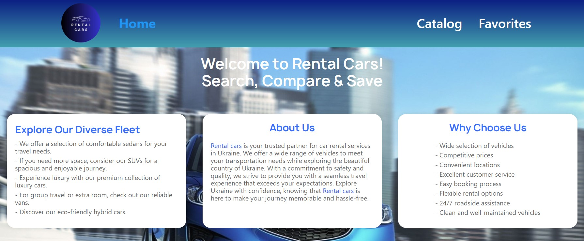
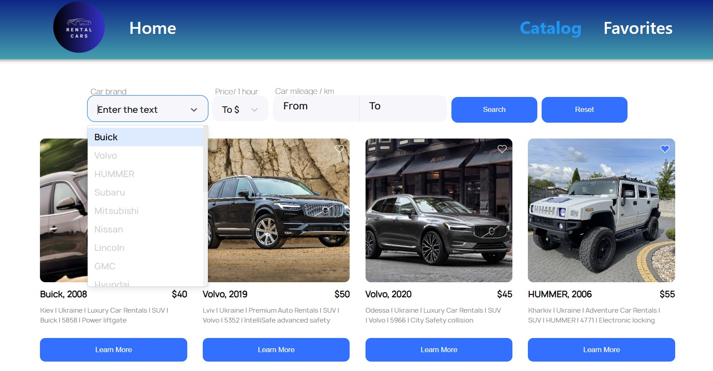
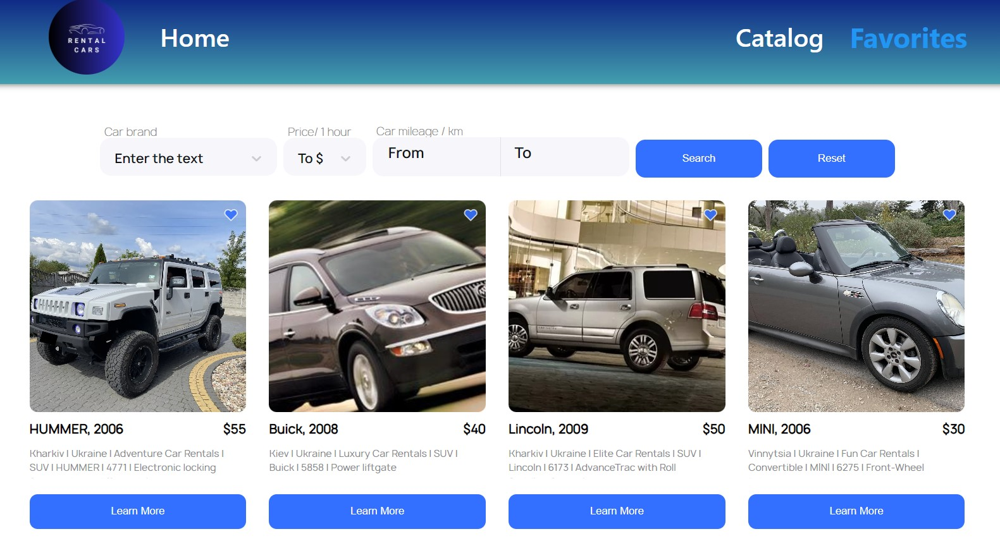
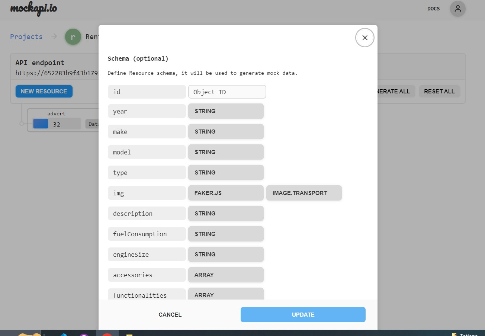
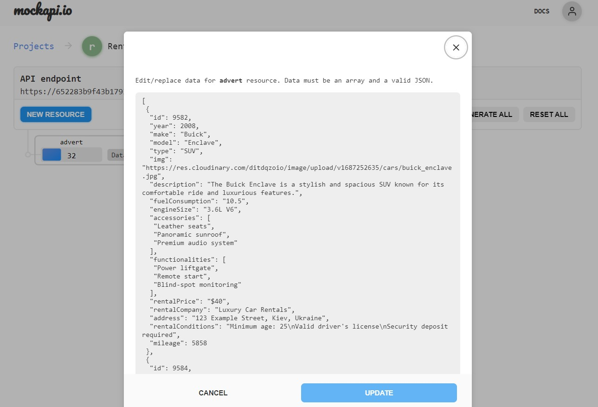

# Rental Car

Rental Car - це веб-додаток, який дозволяє користувачам досліджувати та
орендувати різноманітні транспортні засоби в Україні. За допомогою нашої зручної
платформи ви можете переглядати великий вибір автомобілів, знаходити ідеальний
транспортний засіб для ваших потреб та навіть зберігати обрані пропозиції для
подальшого використання. Незалежно від того, чи потрібен вам автомобіль для
службової поїздки, сімейної відпустки або щоденних поїздок, наш сервіс покриє
всі ваші потреби.

## Основні функції

### Пошук

- Переглядайте різноманітний вибір автомобілів, включаючи седани, SUV,
  мікроавтобуси та інше.
- Використовуйте фільтри пошуку для швидкого пошуку автомобілів, що відповідають
  вашим уподобанням, таких як марка, модель, рік та вартість оренди.

### Збереження до Обраних

- Створіть список улюблених автомобільних пропозицій.
- Легко доступ до вашого списку та порівняння обраних опцій.
- Отримуйте сповіщення про будь-які оновлення щодо обраних пропозицій.

### Бронювання та Резервація

- Бронюйте обране авто безпосередньо через платформу.
- Переглядайте умови оренди, включаючи вартість, обмеження пробігу та
  доступність.

## Початок Роботи

Щоб розпочати роботу з нашим "Rental Car", дотримуйтеся наступних кроків:

1. Клонуйте цей репозиторій на свій локальний комп'ютер.
2. Встановіть необхідні залежності, запустивши `npm install` або `yarn install`.
3. Запустіть додаток командою `npm start` або `yarn start`.
4. Доступ до додатку в вашому веб-браузері за адресою `http://localhost:3000`.

## Backend

Для бекенда ми можемо використовувати UI-сервіс https://mockapi.io/. Створити
оголошення в Mockapi з наступними полями: id, year, mark, model, type, img,
description, споживання палива, розмір двигуна, аксесуари, функціональні
можливості, ціна оренди, орендна компанія, адреса, умови оренди, пробіг.

 

## Зв'язок з Нами

Якщо у вас є питання, пропозиції або вам потрібна допомога, не соромтеся
звертатися до нашої служби підтримки за адресою tatina892@gmail.com.

Дякуємо, що обрали "Rental Car" для вашого орендного автомобіля в Україні!

Приємних подорожей!
