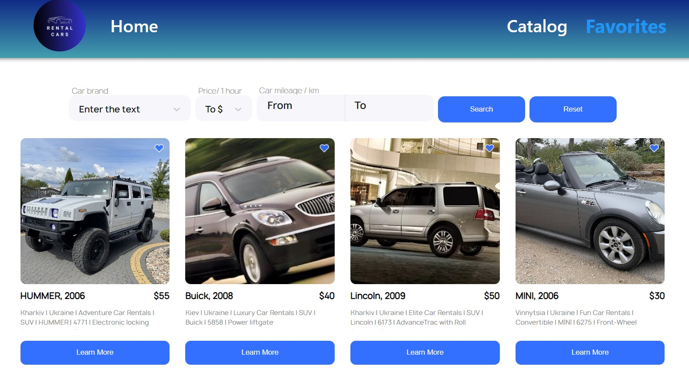
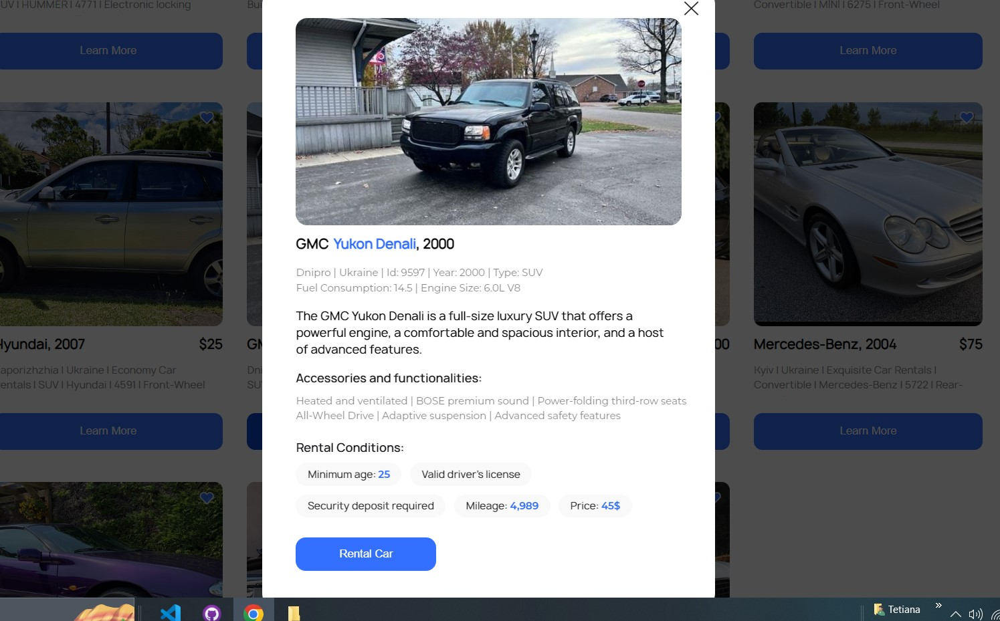
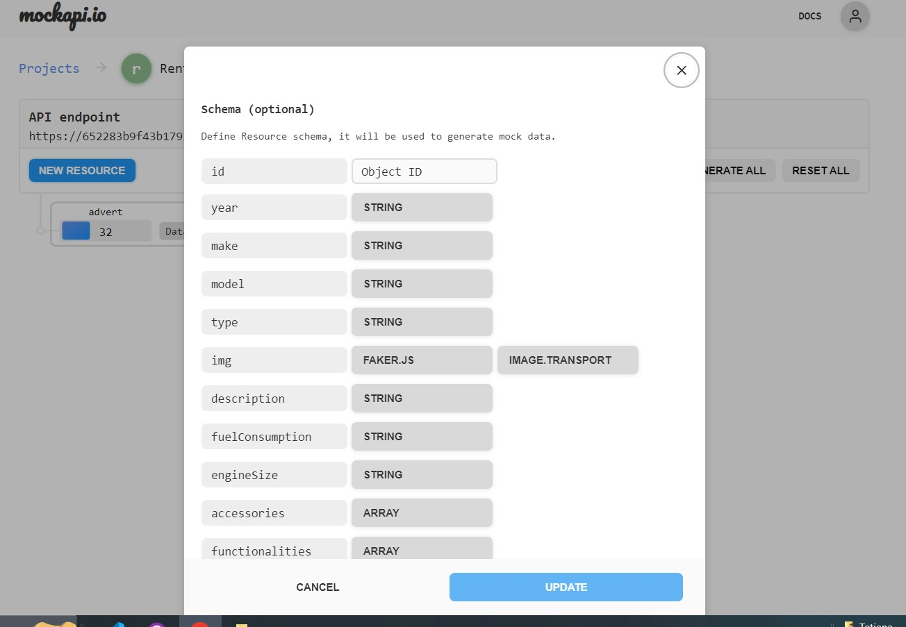
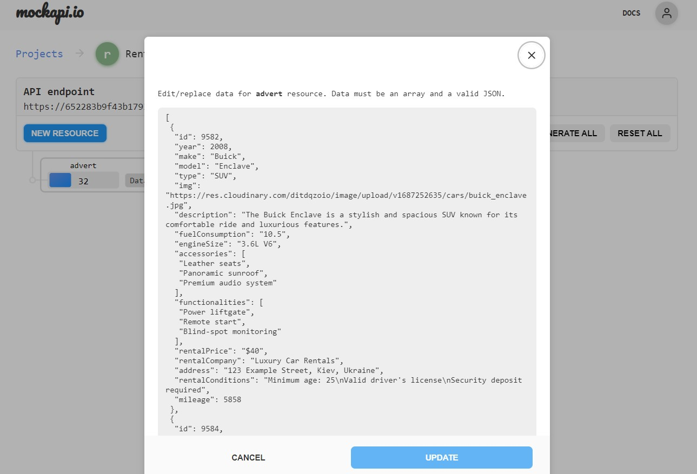

# Rental Car

Rental Car to aplikacja internetowa, która pozwala użytkownikom przeglądać i
wynajmować szeroką gamę gama pojazdów na Ukrainie. Dzięki naszej przyjaznej dla
użytkownika platformie możesz przeglądać poprzez różnorodne opcje samochodu,
znajdź idealny pojazd odpowiadający Twoim potrzebom, a nawet zapisz swoje
ulubione oferty na później. Niezależnie od tego, czy potrzebujesz samochodu dla
podróż służbowa, rodzinne wakacje lub po prostu codzienne dojazdy do pracy, nasz
serwis ma przykryłeś.

## Cechy

### Eksploruj i szukaj

- Przeglądaj różnorodną gamę samochodów, w tym sedany, SUV-y, samochody
  dostawcze i więcej.
- Użyj filtrów wyszukiwania, aby szybko znaleźć samochody odpowiadające Twoim
  preferencjom, np marka, model, rok i cena wynajmu.

### Zapisz w Ulubionych

- Utwórz listę swoich ulubionych ofert samochodów.
- Łatwy dostęp i porównywanie zapisanych opcji.
- Otrzymuj powiadomienia o wszelkich aktualizacjach Twoich ulubionych ofert.

### Rezerwacje i rezerwacje

-Zarezerwuj wybrany samochód bezpośrednio z platformy.

- Przejrzyj warunki wynajmu, w tym ceny, przebieg i dostępność.

## Pierwsze kroki

Aby rozpocząć korzystanie z naszego Drive Ukraine Now, wykonaj następujące
kroki:

1. Sklonuj to repozytorium na swój komputer lokalny.
2. Zainstaluj niezbędne zależności, uruchamiając `npm install` lub „instalacja
   przędzy”.
3. Uruchom aplikację za pomocą `npm start` lub `yarn start`.
4. Uzyskaj dostęp do aplikacji w przeglądarce internetowej pod adresem
   `http://localhost:3000`.

## Backend

Do backendu możemy wykorzystać usługę UI https://mockapi.io/. Utwórz ogłoszenie
w Mockapi z kolejnymi polami: id, rok, marka, model, typ, img, opis, zużycie
paliwa, rozmiar silnika, akcesoria, funkcjonalności, cena wynajmu, WynajemFirma,
adres, Warunki wynajmu, przebieg.

 

## Skontaktuj się z nami

Jeśli masz jakieś pytania, sugestie lub potrzebujesz pomocy, nie wahaj się
skontaktować nasz zespół wsparcia pod adresem tatina892@gmail.com.

Dziękujemy za wybranie Drive Ukraine Now do wynajmu samochodów na Ukrainie!

Szczęśliwych podróży!
